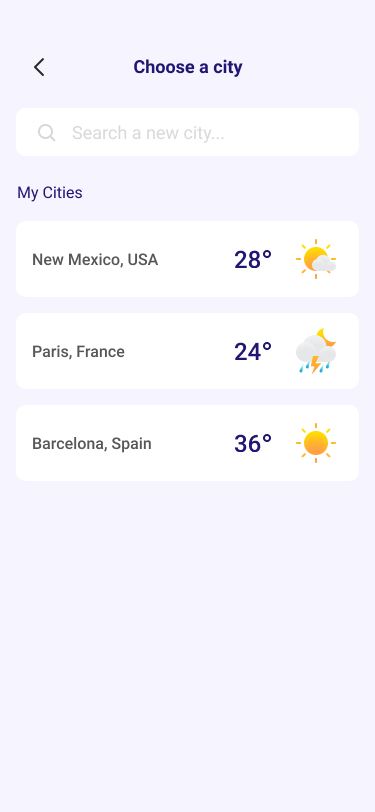

# 🌦️ Weather Forecast App

A simple and interactive weather forecast application that allows users to search for weather data by city, displays the current conditions, and keeps a searchable history using `localStorage`.

## 🔧 Features

- 🔍 **City-Based Weather Search**  
  Enter a city name and instantly fetch weather data using the [WeatherAPI](https://www.weatherapi.com/).

- 📦 **LocalStorage Search History**  
  Your search history is saved locally and persists even after reloading the page.

- 🔁 **Search Result Overwrite**  
  Each new search replaces the previous weather display for clarity.

- 🧹 **Clear History Functionality**  
  One-click button to clear your saved search history and UI.

- 🌐 **Location-Specific Queries**  
  All weather queries are scoped to cities within Ethiopia (you can modify this easily).

## 🖼️ Demo Preview
   ### Get started page view:


 ### Home page view:


### Search page view :



## 🚀 Getting Started

### 📁 Project Structure

```
├── Search.css
├── Search.html
├── Search.js
├── UI
    ├── Get started.png
    ├── Home.png
    └── Search.png
├── home.css
├── home.html
├── home.js
├── images
    ├── Overcast.png
    ├── clouds.png
    ├── cloudy.png
    ├── cloudy_moon.png
    ├── cloudy_sunny 1.png
    ├── mostly_sunny.png
    ├── rainy.png
    ├── rainy_lightning.png
    ├── rainy_lightning_windy_sunny.png
    ├── shower_windy_lightning_moon_icon.png
    └── sunny_icon.png
├── index.html
├── style.css
└── weather-app.js

```

## 📦 Dependencies
- Vanilla JavaScript (no frameworks)
- WeatherAPI (Free tier is sufficient)

## 🧪 How to Run
1. Clone or download this repo.

2. Open index.html in any modern web browser.

3. Start typing a city name and press Enter to see results.

## ⚙️ API Configuration
- You will need a free WeatherAPI key:

- Sign up at https://www.weatherapi.com/

- Replace the sample key in script.js:

```js
// Replace with your key
const API_KEY = 'your_api_key_here';
```

## 📌 Limitations
- Searches are limited to cities within Ethiopia (you can remove ,Ethiopia in the URL to allow worldwide).

- No autocomplete or suggestions (but can be added).

- Basic styling — feel free to customize.

## 💡 Future Improvements
- Add current location support (geolocation)

- Responsive mobile-friendly UI

- Weather icons and themes based on conditions

- Limit history to last 5–10 searches

- Export/import search history

## 👨‍💻 Developed By

<h1 style="color:cyan;text-shadow: 0 0 15px cyan;text-align:center;font-size:4em"> NADX  </h1>

<h3 style="color:cyan;text-shadow: 0 0 15px cyan;text-align:center;font-size: 2em">Web Developer</h3>
<hr>

## 👨‍💻 Connect with me

[](https://t.me/nisimp)  
[](https://linkedin.com/in/Natthy2023)

## 📝 License
This project is open-source and free to use under the MIT License.

## 🙌 Acknowledgments
- [WeatherAPI.com](https://www.weatherapi.com/) for their free and easy-to-use API